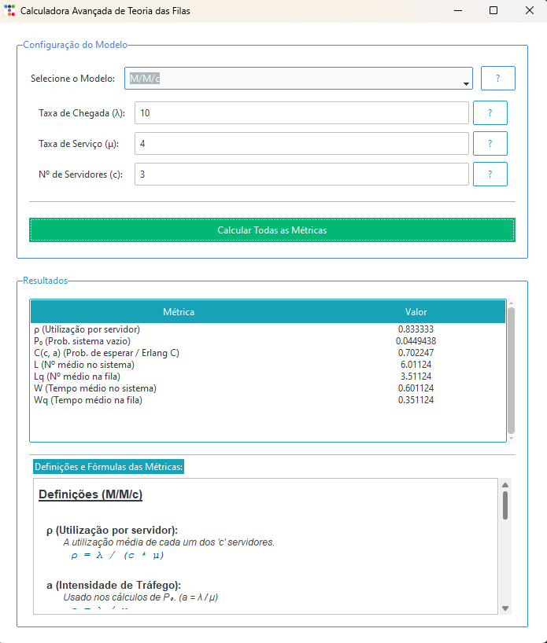
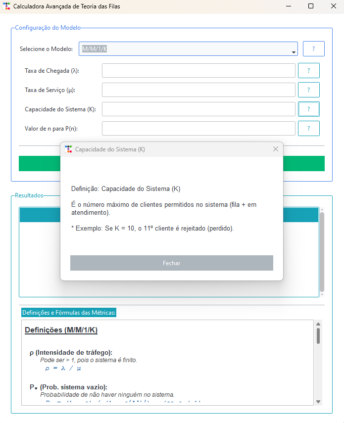
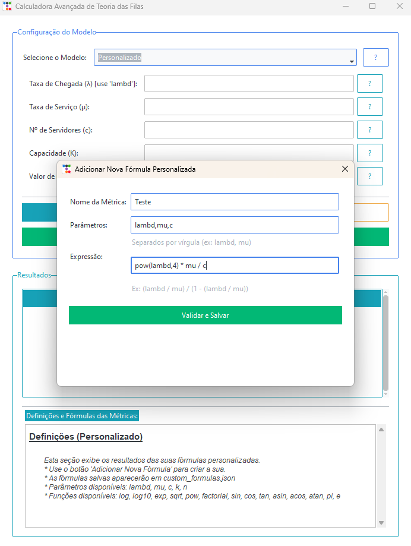

# Calculadora Avançada de Teoria das Filas

Uma ferramenta de desktop, construída em Python e `ttkbootstrap`, para calcular e analisar métricas de desempenho de sistemas de filas.

Este projeto vai além de uma simples calculadora, servindo como uma ferramenta educacional interativa. Ela permite que os usuários não apenas obtenham resultados (como $L$, $L_q$, $W$, $W_q$), mas também entendam o que cada modelo significa, o que cada parâmetro representa e quais fórmulas foram usadas para chegar ao resultado.

## Funcionalidades Principais

* **Interface Gráfica Moderna:** Utiliza `ttkbootstrap` (baseado no Tkinter) para uma aparência limpa, profissional e com temas.
* **Cálculo "Tudo em Um":** Em vez de calcular uma métrica por vez, o usuário seleciona um modelo, insere os parâmetros, e o sistema calcula *todas* as métricas de desempenho relevantes de uma só vez.
* **Modelos Suportados:**
    * **M/M/1:** Um servidor, fila infinita.
    * **M/M/c:** Múltiplos servidores, fila única infinita.
    * **M/M/∞:** Servidores infinitos (modelo de autoatendimento).
    * **M/M/1/K:** Um servidor, capacidade finita (com perdas).
    * **Comparativo (M/M/1 vs M/M/∞):** Uma ferramenta de análise que compara um sistema de servidor único contra um sistema ideal com os mesmos parâmetros.
* **Módulo de Fórmulas Personalizadas:**
    * **Modelo "Personalizado":** Permite ao usuário adicionar, salvar e calcular suas próprias fórmulas.
    * **Criação Dinâmica:** Uma interface pop-up permite definir um nome, os parâmetros (ex: `lambd, mu, c`) e a expressão matemática (ex: `(lambd / mu) / (1 - (lambd / mu))`).
    * **Validação Segura:** As expressões são validadas usando o módulo `ast` para permitir apenas operações matemáticas seguras, prevenindo a execução de código malicioso.
    * **Persistência:** As fórmulas criadas são salvas em um arquivo `custom_formulas.json`, ficando disponíveis em futuras utilizações.
    * **Gerenciamento:** Uma interface dedicada permite ao usuário visualizar e deletar fórmulas salvas.
* **Importação e Exportação de Dados:**
    * **Exportar para PDF:** Após calcular, um botão permite exportar um relatório completo em PDF com os parâmetros e resultados.
    * **Importar de .txt:** Um botão permite carregar parâmetros de um arquivo `.txt`. O parser inteligente usa RegEx para ler frases em linguagem natural (ex: "taxa de chegada é 10").
* **Sistema de Ajuda Integrado e Contextual:**
    * **Ajuda de Modelos:** Um botão "?” ao lado da seleção de modelos explica a diferença, os casos de uso e as premissas de cada um dos 6 modelos.
    * **Ajuda de Parâmetros:** Cada campo de parâmetro (λ, μ, c, k, n) possui um botão "?” que explica o que aquele parâmetro significa. A ajuda é contextual (ex: a ajuda de λ no modo "Personalizado" explica a necessidade de usar `lambd`).
    * **Ajuda de Métricas (Definições e Fórmulas):** Abaixo da tabela de resultados, uma caixa de texto é preenchida dinamicamente com as definições e as fórmulas exatas (em notação Unicode) usadas para calcular cada métrica daquele modelo específico.

## Visualização (Screenshots)

| Tela Principal (M/M/c) | Ajuda de Parâmetro (Pop-up) |
| :---: | :---: |
|  |  |

| Criação de Fórmula Personalizada |
| :---: |
|  |

## Requisitos

* Python 3.8+
* Bibliotecas: `ttkbootstrap` e `reportlab`

## Download (Executável)

Para usuários de Windows que desejam apenas **usar o programa** sem precisar instalar Python ou qualquer dependência, uma versão executável (`.exe`) está disponível.

:arrow_down: **[Clique aqui para baixar a versão mais recente](https://github.com/caio10012/queue-metrics-calculator/releases/latest)**

1.  Baixe o arquivo `.zip` da página de "Releases".
2.  Extraia o conteúdo do `.zip` para uma pasta.
3.  Execute o arquivo `CalculadoraFilas.exe`.

## Como Usar o Programa

1.  Selecione o modelo de fila desejado no menu (ex: "M/M/c").
2.  (Opcional) Clique em **"Importar Parâmetros de Arquivo"** e selecione um `.txt` com o problema.
3.  (Opcional) Preencha ou ajuste os parâmetros (ex: λ, μ, c). Use los botões "?” ao lado de cada campo se tiver dúvidas.
4.  Clique em "Calcular Todas as Métricas".
5.  Analise os resultados na tabela superior.
6.  (Opcional) Clique em **"Exportar Resultados para PDF"** para salvar um relatório.
7.  Role para baixo na área "Resultados" para ver as definições e as fórmulas exatas que geraram aqueles números.

**Para Fórmulas Personalizadas:**

1.  Selecione o modelo "Personalizado".
2.  Clique em "Adicionar Nova Fórmula".
3.  Preencha o nome, os parâmetros (`lambd`, `mu`, `c`, `k`, `n`) e a expressão matemática segura.
4.  Clique em "Salvar". A fórmula agora está disponível.
5.  Para remover fórmulas, clique em "Gerenciar Fórmulas".

## Empacotando para Windows (Criando .exe)

Para criar um arquivo executável (`.exe`) que funcione em outros computadores Windows sem precisar instalar Python.

1.  Certifique-se de ter o `pyinstaller`, `ttkbootstrap` e `reportlab` instalados no seu ambiente virtual:
    ```bash
    pip install pyinstaller ttkbootstrap reportlab
    ```

2.  Execute o PyInstaller (substitua `Calculadora.py` pelo nome do seu arquivo). O comando `--add-data` é **essencial** para incluir seus outros scripts Python.

    ```bash
    pyinstaller --onefile --windowed --name="CalculadoraFilas" --add-data="param_parser.py;." --add-data="pdf_export.py;." Calculadora.py
    ```

3.  O arquivo `.exe` final estará dentro da pasta `dist`.
